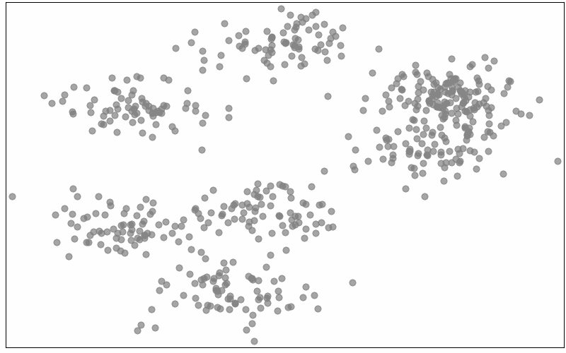
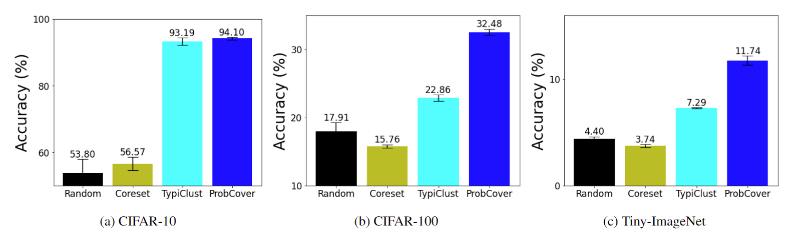

# Typiclust and ProbCover Official Code Repository


This is the official implementation for the papers **Active Learning on a Budget - Opposite Strategies Suit High and Low Budgets** and **Active Learning Through a Covering Lens**. 

This code implements TypiClust and ProbCover - Simple and Effective Low Budget Active Learning methods.
## Typiclust

[**Arxiv link**](https://arxiv.org/abs/2202.02794), 
[**Twitter Post link**](https://twitter.com/AvihuDkl/status/1529385835694637058), 
[**Blog Post link**](https://avihu111.github.io/Active-Learning/)


TypiClust first employs a representation learning method, then clusters the data into K clusters, and selects the most Typical (Dense) sample from every cluster. In other words, TypiClust selects samples from dense and diverse regions of the data distribution.

Selection of 30 samples on CIFAR-10:


Selection of 10 samples from a GMM:


TypiClust Results summary


## Probability Cover

[**Arxiv link**](https://arxiv.org/abs/2205.11320), 
[**Twitter Post link**](https://mobile.twitter.com/AvihuDkl/status/1579497337650839553), 
[**Blog Post link**](https://avihu111.github.io/Covering-Lens/)

ProbCover also uses a representation learning method. Then, around every point is placed a $\delta$-radius ball, and the subset of $b$ (budget) balls which covers the most of the points is selected, with their centers chosen as the samples to be labeled.

Unfolding selection of ProbCover



ProbCover results in the Semi-Supervised training framework



## Usage

Please see [`USAGE`](USAGE.md) for brief instructions on installation and basic usage examples.

## Citing this Repository
This Repository makes use of two repositories: ([SCAN](https://github.com/wvangansbeke/Unsupervised-Classification) and [Deep-AL](https://github.com/acl21/deep-active-learning-pytorch))
Please consider citing their work and ours:
```
@article{hacohen2022active,
  title={Active learning on a budget: Opposite strategies suit high and low budgets},
  author={Hacohen, Guy and Dekel, Avihu and Weinshall, Daphna},
  journal={arXiv preprint arXiv:2202.02794},
  year={2022}
}

@article{yehudaActiveLearningCovering2022,
  title = {Active {{Learning Through}} a {{Covering Lens}}},
  author = {Yehuda, Ofer and Dekel, Avihu and Hacohen, Guy and Weinshall, Daphna},
  journal={arXiv preprint arXiv:2205.11320},
  year={2022}
}
```

## License
This toolkit is released under the MIT license. Please see the [LICENSE](LICENSE) file for more information.
