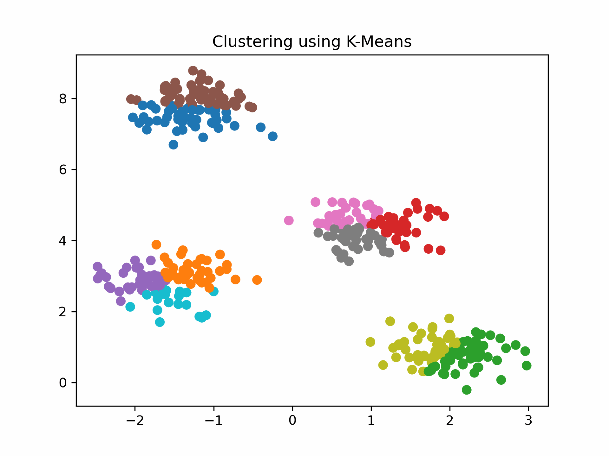

# Active Learning on a Budget - Opposite Strategies Suit High and Low Budgets

## Introduction

This is the official implementation for the paper **Active Learning on a Budget - Opposite Strategies Suit High and Low Budgets**. 
This code implements TypiClust - a Simple and Effective Low Budget Active Learning method.

[**Arxiv link**](https://arxiv.org/abs/2202.02794), 
[**Twitter Post link**](https://twitter.com/AvihuDkl/status/1529385835694637058)

TypiClust first employs a representation learning method, then clusters the data into K clusters, and selects the most Typical (Dense) sample from every cluster. In other words, TypiClust selects samples from dense and diverse regions of the data distribution.

Selection of 30 samples on CIFAR-10:


Selection of 10 samples from a GMM:



TypiClust Results summary


## Usage

Please see [`USAGE`](USAGE.md) for brief instructions on installation and basic usage examples.

## Citing this Repository
This Repository makes use of two repositories: ([SCAN](https://github.com/wvangansbeke/Unsupervised-Classification) and [Deep-AL](https://github.com/acl21/deep-active-learning-pytorch))
Please consider citing their work and ours:
```
@article{hacohen2022active,
  title={Active learning on a budget: Opposite strategies suit high and low budgets},
  author={Hacohen, Guy and Dekel, Avihu and Weinshall, Daphna},
  journal={arXiv preprint arXiv:2202.02794},
  year={2022}
}
```

## License
This toolkit is released under the MIT license. Please see the [LICENSE](LICENSE) file for more information.
